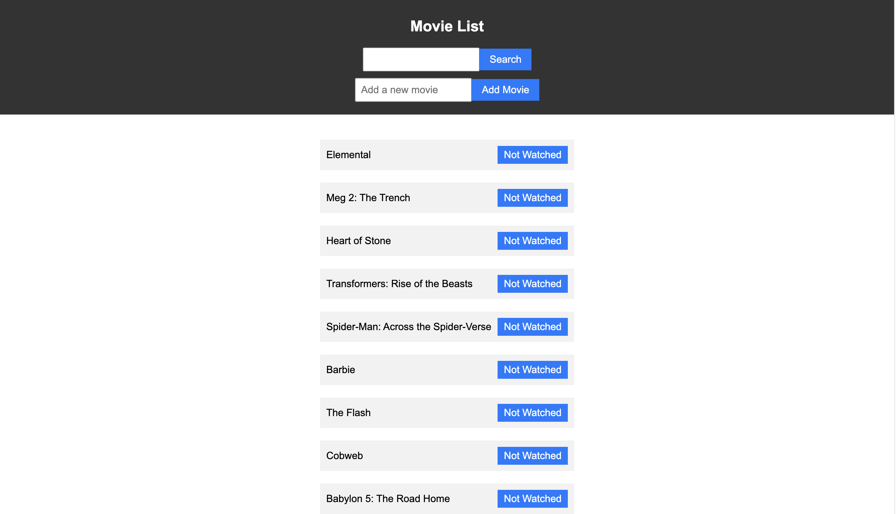

# Movie List
This is a project I completed as a student at [hackreactor](http://hackreactor.com).



## Getting Started

  ```
  npm install

  npm run react-dev

  npm start

  Open localhost:3000 in the browser
  ```
